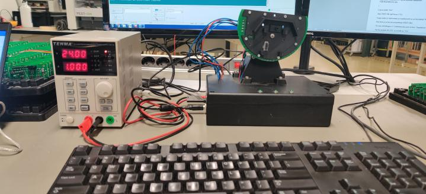

# T3439
Automated tester for the M3439 project.

It makes use of Trinamic TMCL motor & driver.

<!-- TOC -->
## Navigation
- [Navigation](#T3439)
    - [Requirements](#Requirements)
    - [Todo Lists](#Todo)
    - [Setup](#Setup)
    - [Footnotes](#Footnotes)
<!-- /TOC -->

## Requirements
### Prerequisites - Code
- MPLAB X v5.45 or higher
- XC16 v1.61
- TEST-TRACK 4.2
### Prerequisites - PCB
- See BOM file
- pd-109-57
- PIC24FJ128GA306 @ 16MHz
- PCBA T3439
- Autodesk EAGLE
### Prerequisites - Frame
- Autodesk Fusion360
- See BOM file
- See [Setup](#Setup)

## Todo
### Overiew
- [x] Develop PCB for driving machine
- [x] Write firmware for PIC24FJ128GA306
- [x] Create Frame for machine
- [x] Write TEST-OK scripting

## Setup

## Footnotes
### Built With

* [MPLABX](https://www.microchip.com/en-us/development-tools-tools-and-software/mplab-x-ide) - IDE used
* [Autodesk EAGLE](https://www.autodesk.com/products/eagle/free-download) - Schematics CAD used
* [Autodesk Fusion360](https://www.autodesk.nl/products/fusion-360/overview) - CAD used

### Versioning

I use Compile Date and time for versioning.
> Current version: JUL 29 2021 11:56:50

### Authors

* [**Tariq Dinmohamed**](https://github.com/Flixis)
* Jasper anemaat

### Acknowledgments

* Shoutout to StackOverFlow without you people this would have never happenend, yes that includes the bugs you may have created.

